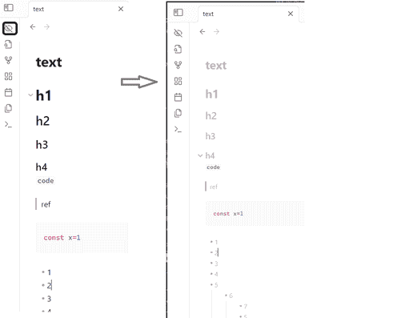

# Simple disguise / 简单伪装

## Introduction
Disguise/obscure/hide the content in a very simple way. Prevent your editing content from being seeing clearly too easily by others passing by in public spaces.

## Implementation Principle
This feature is implemented using minimal code.  
Modifying the styles of the editing area via CSS.

## Usage
After installing and activating the plugin:  
Click the button in the sidebar to toggle between disguise mode and normal mode.

## Not Supported:
- Reading view.
- Command-based control.
- Defining styles in settings (styles can only be adjusted directly by editing the `styles.css` file in the plugin directory).

## 功能简介
一键切换编辑内容的背景颜色和文本颜色, 防止在公共空间中编辑内容时, 被路过的人过于容易的看清楚正在编辑的内容

## 实现原理
使用最简单的方式实现这个功能
通过css修改编辑框中的样式

## 使用方式
安装并开启插件后, 点击侧边栏中的按钮, 控制伪装/恢复正常

## 不支持:
- 阅读视图
- 命令方式控制
- 在setting中定义样式(只能直接修改插件目录中的styles.css进行样式调整)
